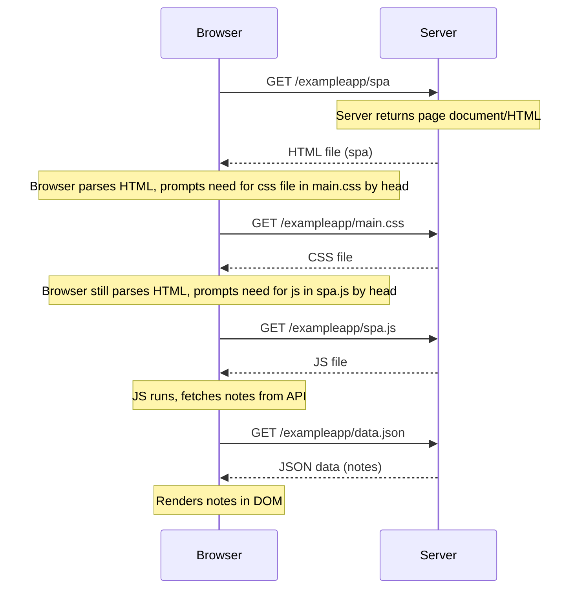

```mermaid
sequenceDiagram
    participant Browser
    participant Server

    Browser->>Server: GET /exampleapp/spa
    Note over Server: Server returns page document/HTML
    Server-->>Browser: HTML file (spa)

    Note over Browser: Browser parses HTML, prompts need for css file in main.css by head

    Browser->>Server: GET /exampleapp/main.css
    Server-->>Browser: CSS file

    Note over Browser: Browser still parses HTML, prompts need for js in spa.js by head

    Browser->>Server: GET /exampleapp/spa.js
    Server-->>Browser: JS file

    Note over Browser: JS runs, fetches notes from API

    Browser->>Server: GET /exampleapp/data.json
    Server-->>Browser: JSON data (notes)

    Note over Browser: Renders notes in DOM
```