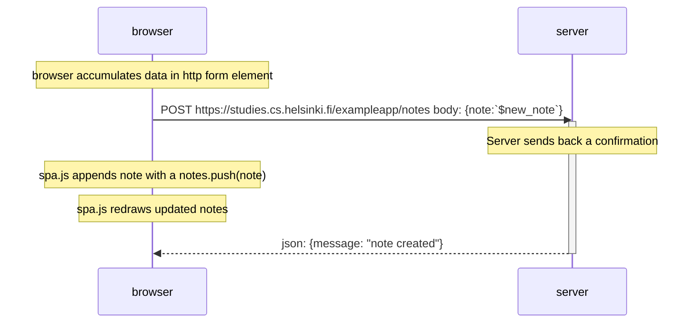

```mermaid
sequenceDiagram
    participant browser
    participant server

    note over browser: browser accumulates data in http form element

    browser->>server: POST https://studies.cs.helsinki.fi/exampleapp/notes body: {note:`$new_note`}
    activate server
    note over server: Server sends back a confirmation
    note over browser: spa.js appends note with a notes.push(note)
    note over browser: spa.js redraws updated notes

    server-->>browser: json: {message: "note created"}
    deactivate server

```